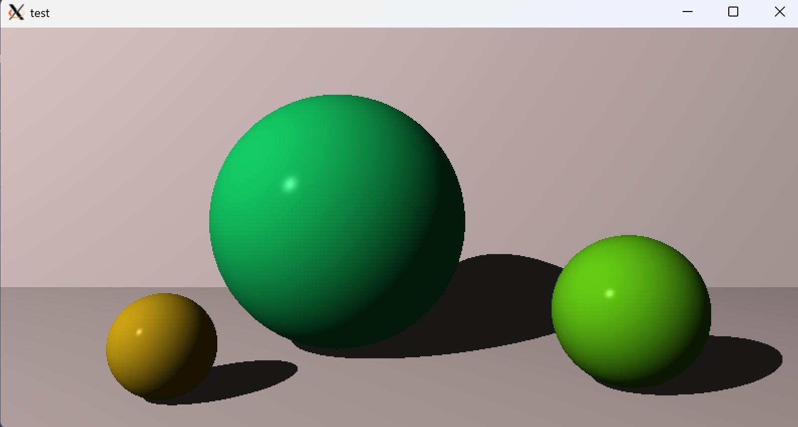
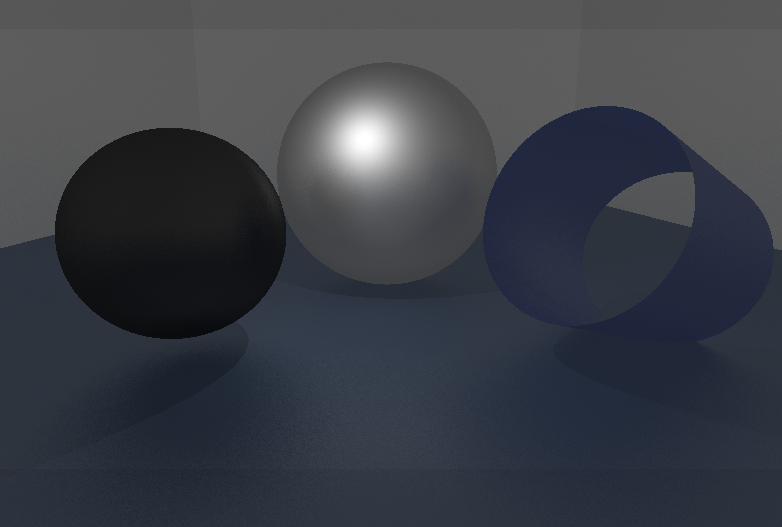
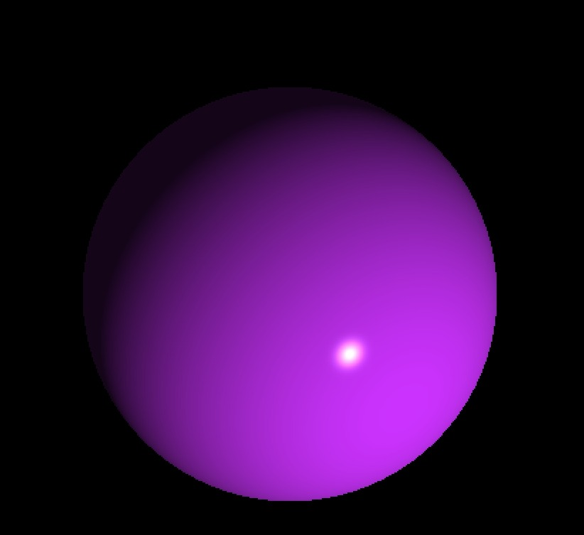

# 🌟 MiniRT  
>_A minimal ray tracer in C_

**MiniRT** is a lightweight ray tracing engine written in C, developed as part of the 42 school curriculum. It renders 3D scenes described in `.rt` files using basic geometric primitives, realistic lighting, and shading — all built from scratch using only MiniLibX for display.

---
<p align="center">
  
  </p>

---
## 📌 Project Overview

This project was an opportunity to explore computer graphics from the ground up. It involved implementing a full rendering pipeline without relying on external libraries — just vectors, math, and system-level C code.

The result is a real-time, windowed ray tracer capable of interpreting a scene files and rendering them with ambient, diffuse, and specular lighting.

---

## 🧠 Features

- 🧾 **Scene parsing** from plain `.rt` files
- 📸 **Camera** with adjustable position, orientation, and FOV
- 💡 **Lighting system**:
  - Ambient light
  - Point light(s) with RGB color and brightness
- 🔷 **Geometric primitives**:
  - Spheres
  - Planes
  - Cylinders
- 🎨 **Phong shading** with ambient, diffuse, and specular components
- 🌑 **Shadows**
  - Reflections
  - Textures or patterns
  - Camera movement or anti-aliasing
- 🪟 Output rendered in a MiniLibX window

---
## 📸 Screenshots

Here are a few example renders created with MiniRT:
<p align="center">
  
</p>

<p align="center">
  
</p>


## 📂 Example Scene (`.rt` format)

```txt
A 0.2 255,255,255          # Ambient light
C 0,0,0 0,0,1 70           # Camera (pos, dir, FOV)
L -40,0,30 0.7 255,255,255 # Point light
sp 0,0,20 20 255,0,0       # Sphere
pl 0,-30,0 0,1,0 0,255,0   # Plane
cy 50,0,20 0,1,0 14.2 21.42 10,0,255 # Cylinder
```
---

## 🛠️ Building the Project

To compile the project, simply run:

```bash
git clone https://github.com/Fernandajo/MiniRT.git
cd MiniRT
make
```
To render a scene:

```bash
./miniRT scenes/example.rt
